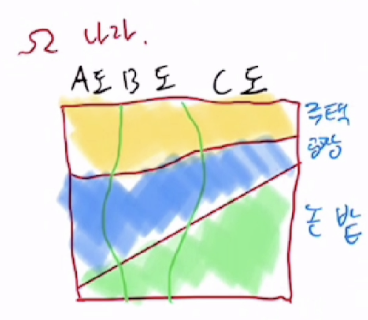

## 3. 
어떤 함수 (문제) => 입력과 출력이 있는 시스템
문제를 푸는 시스템 => 문제를 집어넣으면 답이 나오는 시스템
F(x): R -> R : 존재한다고 가정
M(x) ~ F(x) 충분히 근사할 수 있으면 M = F 라고 말할 수 있다.
M = 다항식과 활성화 함수의 조합으로 만들어지는 근사함수. (시벤코 정리)

다항식 : 단순
비선형 : 시그모이달 함수

AI -> 다항식은 미분 가능하다. 비선형 함수 Sigmoid 함수는 미분 가능하다.
즉 M은 미분 가능하므로 그라디언트 디센트 알고리즘을 적용할 수 있다.

AI로 M을 만들자.

그림에서 숫자를 판단하는 함수

F(그림) -> 숫자
M 위 함수를 근사해서 사용하자.

P : 다항식
비선형함수 : 활성화 함수

Sigmoid(P) 확장 : 모델 M을 만든다.

## 4. 옵티마이저 (SGD, ADam) (선형대수 + 확률통계)
그라디언트 디센트 알고리즘 변형버전.
SGD 끝.
Adam : Momentum 적용.
## 5. 데이터 정규 (확률통계)
Omega(tprP, 확률공간), 확률변수, 확률분포
### 확률변수 : X Y Z

근원이가 복권을 샀을때, 탈락확률이 0.7 당첨확률이 0.3
근원이가 내일 카레를 먹을 확률은 0.5 아닐확률은 0.5
그럼 근원이가 내일 카레를 먹으면서 당청될 확률은? 0.5 * 0.3

P(X = 탈락) = 0.7
P(X = 당첨) = 0.3

Y = 근원이가 내일 카레를 먹을 확률
확률 면적은 무조건 = 1

**독립된 확률변수에 대한 결합확률은 : 곱**

### 확률 분포

### 주변 분포
### 조건부 분포
### 결합 분포

## 확률을 생각할 때 넓이, 부피, 면적으로 생각하라
- 2차원, 3차원

## 분포

### 1. 주변 분포
P(X)

### 2. 조건부 분포(확률)
P(A | 공장)

"다른 도와 비교해서 A도는 공장을 중시하는 것 같다. 이와 같은 모습을 알기에 각 도내의 공장 면적인 P(A, 공장)과 P(B, 공장)과 P(C, 공장)을 비교하면 안된다."

### 3. 결합 분포
P(X, Y)

P(주택|A) + P(공장|A) + P(논밭|A) = 1

P(A) + P(B) + P(C) = 1

수학적으로 둘다 1은 맞지 않지만 1을 전체 영역이라고 생각하면 된다.

### 4. 베이지안 공식
P(A) = 0.2

P(B) = 0.32

P(C) = 0.48

P(A | 공장) = A도 공장 면적을 나라 전체 공장 면적으로 나눈것.

P(A | 공장) = P(A, 공장) / P(공장)

 

분자 : A도 공장 면적은?

P(A, 공장) = P(공장|A)P(A) = 0.6 * 0.2 = 0.12

 

분모 : 경우에 따라 구분해서 집계

P(공장) = P(A, 공장) + P(B, 공장) + P(C, 공장)

P(B, 공장) = P(공장|B)P(B) = 0.32*0.25 = 0.08

P(C, 공장) = P(공장|C)P(C) = 0.48*0.25 = 0.12

 

P(A|공장) = P(A,공장) / P(공장)

P(A|공장) = P(A, 공장) / P(A, 공장) + P(B, 공장) + P(C, 공장)

P(A|공장) = P(A, 공장) / (P(공장|A)P(A) + P(공장|B)P(B) + P(공장|C)P(C)

P(A), P(B), P(C), P(공장|A), P(공장|B), P(공장|C)가 주어졌을 때
P(A|공장)을 구하기

### 비율이 획일적인 경우 (독립성)
주택 30%, 공장 20%, 논밭 50%
A: 20%, B: 30%, C: 50%

P(주택|A) = 30%

P(주택|B) = 30%

P(주택|C) = 30%

 

P(A, 주택), P(B, 주택), P(C, 주택) 다름.

P(A, 주택) : P(A, 공장) : P(A, 논밭) = P(B, 주택) : P(B, 공장) : P(B, 논밭) = P(C, 주택) : P(C, 공장) : P(C, 논밭)

P(A, 주택) = P(A)P(주택), P(B)P(주택) = P(B)P(주택), P(C)P(주택) = P(C)P(주택)

P(A, 공장) = P(A)P(공장), P(B)P(공장) = P(B)P(공장), P(C)P(공장) = P(C)P(공장)

P(A, 농지) = P(A)P(농지), P(B)P(농지) = P(B)P(농지), P(C)P(농지) = P(C)P(농지)

P(도, 용도) = P(도)P(용도)

P(도, 용도) = P(용도|도)P(도)

하지만 획일적일 경우에는 도에 관계없이 주택의 비율이 일정하기 때문에 P(도)*P(용도)

나라의 총 면적이 1이므로

전국 주택의 비율은 = 전국 주택의 면적

P(A|용도) = P(A)

도의 면적 = 나라의 총 면적중 그 도가 차지하는 비중

## 2주차
P(X | Y) = P(X, Y) / P(Y)
P(X, Y) = P(X | Y) * P(Y)

P(X=a, Y=b, Z=c) = P(X=a|Y=b,Z=c)P(Y=b|Z=c)P(Z=c)

조건부 결합분포의 분해
P(X, Y | Z) = P(X | Y, Z)P(Y | Z)
P(X = a, Y = b | Z = c) = P(X = a | Y = b | Z = c)P( Y = b | Z = c)

P(U = u, V = v, W = w, X = x | Y = y, Z = z)
= P(U = u, V = v | W = w, X = x, Y = y, Z = z)
*P(W = w | X = x, Y = y, Z = z)P(X = x | Y = y, Z = z)

우변 = P(U = u, V = v | W = w, X = x, Y = y, Z = z)P(W = w, X = x | Y = y, Z = z)
= P(U = u, V = v, W = w, X = x | Y = y, Z = z) = 좌변

## 6. Touch 사용
## 7. 인코딩 (수치해석)

